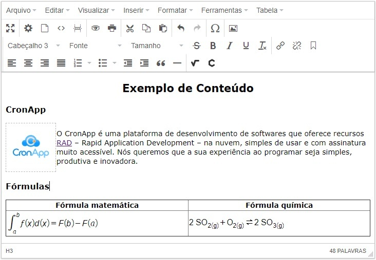

Utilizando o componente Editor de Texto Rico
============================================

O editor de texto rico é um componente que nos permite escrever textos diretamente em uma página HTML, mas diferentemente da área de texto, o editor de texto rico permite realizar diversas formatações no texto, adicionar imagens, tabelas, links, fórmulas e equações matemáticas, realizar impressão do seu conteúdo, adicionar propriedades ao texto e outras funcionalidades.
O editor de texto rico transforma o seu conteúdo em HTML e as imagens inseridas são convertidas para \ `base64 <https://pt.wikipedia.org/wiki/Base64>`__.

Pré-requisitos
--------------

Antes de começar a seguir os passos do tutorial é preciso ter certeza de que se tem um ambiente minimamente preparado para reproduzir o exemplo. Abaixo estão os requisitos principais.

**Requisitos:**

1. Projeto do tipo web criado. Caso haja dúvidas de como criar esse tipo de projeto acesse o link (`Criando Projeto Web <https://docs.cronapp.io/display/CRON2/Criando+Projeto+Web>`__).
2. Gerar uma camada de dados. Em caso de dúvidas, acesse o link (`Geração da camada de dados a partir do diagrama <file:///C:\pages\viewpage.action%3fpageId=26019420>`__).
3. Gerar um `CRUD <https://pt.wikipedia.org/wiki/CRUD>`__\ da camada de dados gerada. Veja como fazer no link (`x. Criação de páginas CRUD <file:///C:\pages\viewpage.action%3fpageId=26019350>`__).

Visão geral: exemplo
--------------------

Nesse tutorial iremos utilizar o editor de texto rico para permitir que o usuário insira um texto editável e exibi-lo no CRUD (Figura 1).

| |image0|
**Figura 1 - Exemplo de inserção de conteúdo no editor de texto Rico**

Funcionalidades
---------------

Algumas funcionalidades do editor são bem interessantes como mostradas na Tabela 1.

+-------------+---------------------------------------------------------------------------------------------------------------------------+
| **ícone**   | **O que faz**                                                                                                             |
+=============+===========================================================================================================================+
| |image1|    | Propriedade do documento. Possibilita adicionar título, palavras-chave, descrição e outras informações ao texto.          |
+-------------+---------------------------------------------------------------------------------------------------------------------------+
| |image2|    | Imprimir. Gera a impressão somente do conteúdo inserido no editor de texto rico.                                          |
+-------------+---------------------------------------------------------------------------------------------------------------------------+
| |image3|    | Pré-visualizar. Abre uma janela exibindo o conteúdo como será visualizado.                                                |
+-------------+---------------------------------------------------------------------------------------------------------------------------+
| |image4|    | Código fonte. Abre uma janela exibindo o código fonte do conteúdo, em HTML, gerado pelo editor.                           |
+-------------+---------------------------------------------------------------------------------------------------------------------------+
| |image5|    | Inserir uma equação matemática. Abre uma janela para permitir a inserção de equações matemáticas de forma simplificada.   |
+-------------+---------------------------------------------------------------------------------------------------------------------------+
| |image6|    | Inserir uma fórmula química. Abre uma janela para permitir a inserção de fórmulas químicas de forma simplificada.         |
+-------------+---------------------------------------------------------------------------------------------------------------------------+
**Tabela 1 - Algumas funcionalidades do editor de texto rico.**

O Editor de texto rico é dividido em 4 partes, como destacado na Figura 2: Barra de menu (1), Barra de tarefas (2), Barra de status (3) e área de edição do texto, que na Figura 2 está estilizada a cor da fonte (vermelho) e a cor de fundo do texto (cor coral).

| |image7|
**Figura 2 - Estrutura do editor de texto rico.**

1. Personalizando o editor rico
~~~~~~~~~~~~~~~~~~~~~~~~~~~~~~~

No editor de texto rico do CronApp é possível desabilitar alguns ícones que aparecem na barra de tarefas e ocultar as barras de status e menu, além de estilizar o texto do usuário com o uso do CSS.
Essas personalizações podem ser feitas utilizando a propriedade Opções (options) do texto rico, como mostradas nas figura 3 e 4: Selecione o campo texto rico na tela (1), clique na subaba “CAMPO” na aba propriedades (2) e clique em “…” da propriedade Opções (3) para exibir a janela de “Opções do Editor Rico” e selecione a aba "Geral" para Ocultar as barras menu, status e estilizar o texto ou a aba "Barra de tarefas"para desabilitar algumas funcionalidades do editor (4).

| |image8|

| |image9|
**Figura 3 e 4 - A configuração exibida aqui está representada na Figura 2.**

2. Equações matemáticas e fórmulas químicas
~~~~~~~~~~~~~~~~~~~~~~~~~~~~~~~~~~~~~~~~~~~

Adicionar fórmulas químicas e equações matemáticas no editor de texto rico é muito simples, basta utilizar as funcionalidades "Inserir uma equação matemática" e "Inserir uma fórmula química". Ambas possuem diversos símbolos matemáticos e químicos para criar fórmulas (Figura 5), além de permitir que o usuário escreva/desenhe a fórmula que será interpretada pelo editor (Figura 6). Outra opção é utilizar comandos LaTex (Figura 7), veja como utilizar em \ `LaTex support <http://docs.wiris.com/en/mathtype/mathtype_web/latex-support>`__. 
 
| |image10|
**Figura 5 - Adicionando fórmulas químicas.**

| |image11|
**Figura 6 - Escrevendo fórmulas matemáticas com o ponteiro do mouse.**

| |image12| 
**Figura 7 - Ao inserir a fórmula em LaTex "$$\\psi=-\\frac{1}{\\varphi}$$ " o editor reconhece a fórmula da figura.**

Passos
------

Crie um projeto web, adicione uma classe, que nomeamos aqui de "Email", gere as camadas de persistências e o CRUD através das funcionalidades (1) e (2) como na Figura 8.

| |image13|
**Figura 8 - Criação da classe, dependências e CRUD.**

1. Substituindo os componentes
~~~~~~~~~~~~~~~~~~~~~~~~~~~~~~

Na tela criada pelo gerador de CRUD (email.view.html), substituímos o componente "Entrada de texto" do conteúdo pelo componente "Editor de Texto Rico", como na FIgura 9.

| |image14|
**Figura 9 - Arrastando o componente de texto rico.**

Precisamos agora vincular o componente editor de texto rico com o campo "conteudo" da nossa classe. Selecione o Editor de texto rico arrastado (1), clique na sub-propriedade "CAMPO" (2) e selecione a opção "Email.active.conteudo" na propriedade Campo (ng-model) (3), como na figura 10.

| |image15|
**Figura 10 - vinculando o editor rico ao campo conteúdo.**

2. Exibindo o texto
~~~~~~~~~~~~~~~~~~~

O Editor de texto rico converte todo o seu conteúdo para HTML, por isso, se não tiver um tratamento no campo que irá exibir o conteúdo, ele ficará como na Figura 11.

| |image16|
**Figura 11 - Exibição do conteúdo do texto rico sem tratamento.**
 

Para evitar isso, precisamos adicionar a propriedade "Vincular HTML"(ng-bind-html do AngularJS) ao campo conteúdo da grid. Seguindo os passos da Figura 12: selecione a grid (1), clique no item "conteúdo" da aba Propriedades (2), procure a propriedade "Vincular HTML" ou insira usando a propriedade "Nova Propriedade" e adicione o comando para renderizar o HTML abaixo (3)::

   **Vincular HTML (ng-bind-html)**
   rowData.conteudo \| renderHTML

| |image17|
**Figura 12 - Configurando a renderização do HTML na GRID.**

3. Testando o componente
~~~~~~~~~~~~~~~~~~~~~~~~

Para acessarmos a página do CRUD que criamos, vamos adicionar um link (1) na nossa home e referenciá-la com a página email.view.html (2). (Figura 13)

| |image18|
**Figura 13 - Adicionando link para a página criada.**

 
Salve os arquivos alterados e execute a aplicação (F9) ou Debug (F11). Após abrir a aplicação, informe login e senha "admin" e confirme para acessar a página home, clique no link que inserimos no\ `passo acima <#UtilizandoocomponenteEditordeTextoRico->`__ para ser direcionado a página que criamos no tutorial.
Clique no botão "Novo", informe um destinatário e um conteúdo formatado como na Figura 14. Ao salvar, o conteúdo será renderizado na grid como na Figura 15.

| |image19| 
**Figura 14 - Inserindo um conteúdo formatado no editor de texto rico.**

| |image20|
**Figura 15 - Exibição do conteúdo renderizado na grid.**

