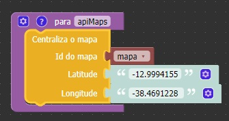

Id do mapa
~~~~~~~~~~
**Tipo:** Identificador.

Identificador do mapa que será centralizado.

Latitude
~~~~~~~~
**Tipo:** String.

Coordenadas geográficas Leste - Oeste.

Longitude
~~~~~~~~~
**Tipo:** String.

Coordenadas geográficas Norte - Sul.

Exemplo
-------

A função abaixo obtém o as coordenadas geográficas, além do id do componente do mapa a fim de centralizá-lo. Essa função poderia ser utilizada a partir do evento 'Ao clicar' do componente mapa.

    Exemplo de uso da função