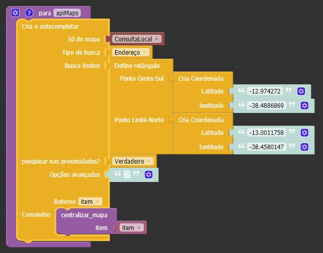

Retorno
-------

Função não possui retorno.

Parâmetros
----------

Id do campo
~~~~~~~~~~
**Tipo:** Identificador.

Identificador do campo de consulta.

Tipo de busca
~~~~~~~~~~~~~
**Tipo:** Opções: Endereço, Estabelecimento, Geocodificação.

Determina a aproximação do mapa. Possui 3 opções:

* **Endereço**: Retorna o autocompletar baseados em endereços.
* **Estabelecimento**: Retorna o autocompletar baseados em nomes de localidades ou estabelecimentos.
* **Geocodificação**: Retorna o autocompletar baseados em em coordenadas geográficas.

Busca limites
~~~~~~~~~~~~~
**Tipo:** String.

Determina a busca por uma área definida.

pesquisar nas proximidades?
~~~~~~~~~~~~~~~~~~~~~~~~~~~
**Tipo:** Booleana.

Define se a consulta ficará restrita as próximidades do usuário.

* **Verdadeiro**: Restringe a consulta.
* **Falso**: Não restringe a consulta.

Opções avançadas
~~~~~~~~~~~~~~~~
**Tipo:** String.

Permite a possibilidade de adição de opções avançadas.

Comandos
~~~~~~~~
**Tipo:** Comandos.

Comandos as serem executados.

Exemplo
-------

No exemplo abaixo o campo 'ConsultaLocal' possui a opção de autoCompletar que irá alterar o mapa após a seleção pelo usuário.

